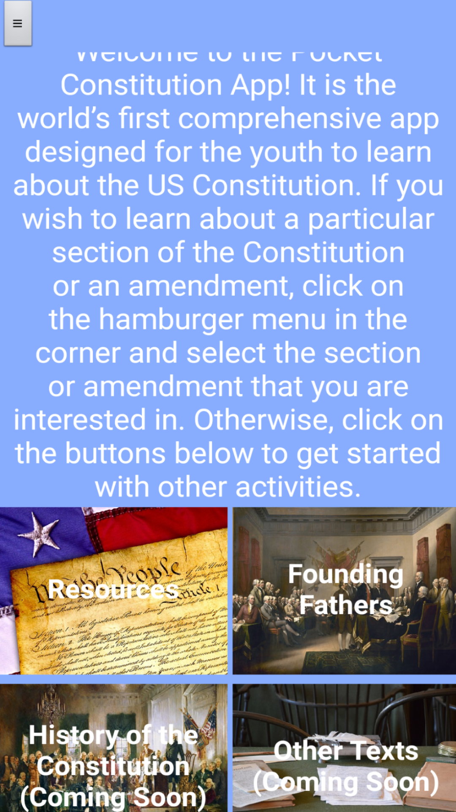
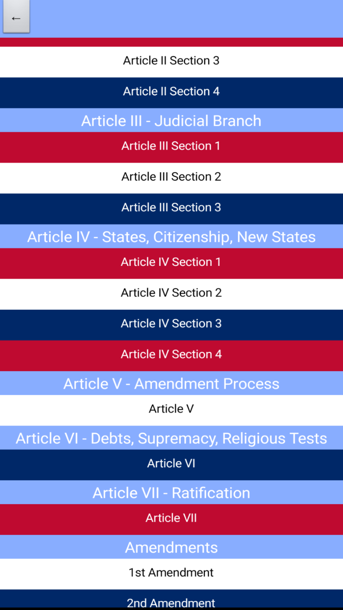
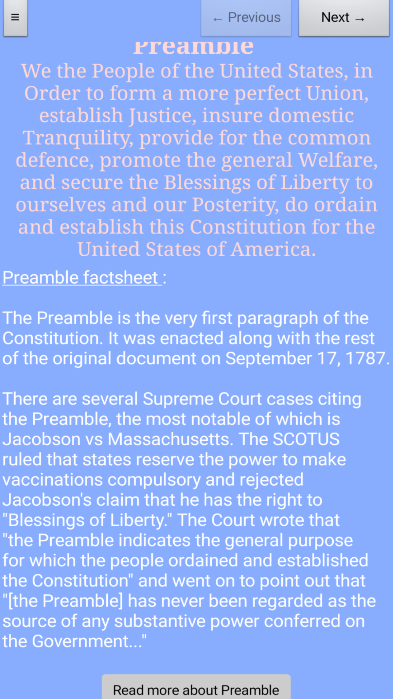
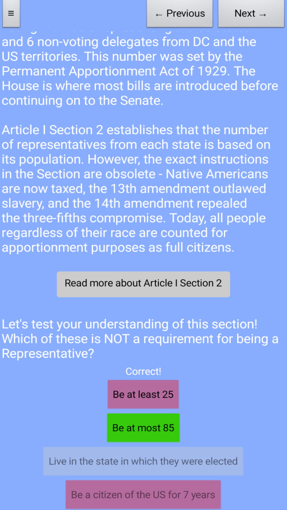
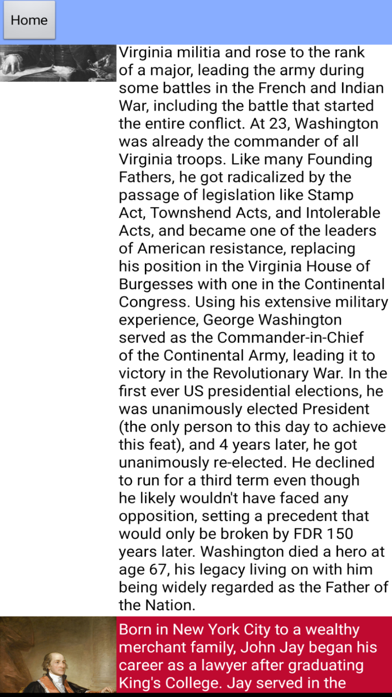
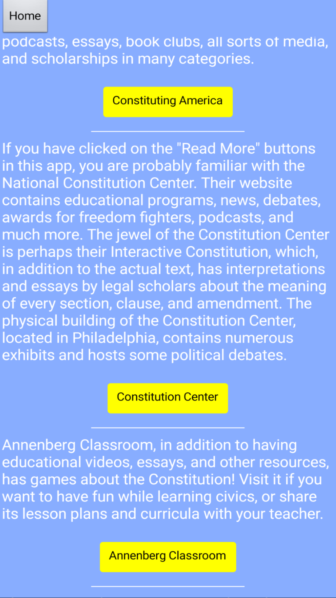

# Pocket Constitution App

<p align="center">  </p>

<p align="center">
  <a href="https://www.amazon.com/gp/product/B09FZTFLJD/ref=mas_dl">
    
  </a>
  <a href="https://gallery.appinventor.mit.edu/?galleryid=160cf12b-95f4-476b-8ce3-101423e1acd5">
    
  </a>
  
  
</p>

<p align="center">
  🏆 Winner of the 2022 Illinois 9th District Congressional App Challenge
</p>

---

## Overview

The **Pocket Constitution App** is an educational Android application created to make learning about the U.S. Constitution and civic engagement more accessible and engaging for younger audiences.

This project was inspired by conversations throughout high school where I noticed many students felt disconnected from politics and civic participation. To help address this issue, I wanted to present traditionally “dry” political topics through a medium that students interact with every day: a mobile app.

This was also my **first experience with app development**.

---

## Features

- 📜 Educational pages covering every Article, Section, and Amendment of the U.S. Constitution
- 🧠 Short quizzes to test understanding of the sections and amendments
- 👤 Biographies of the Founding Fathers
- 🗳️ Resources and nonprofits that help young people become politically involved
- 📱 Mobile-friendly educational experience designed for accessibility and engagement

---

## Built With

- **MIT App Inventor**
- Android APK distribution

---

## Screenshots

<p align="center">
  
  <br>
  <em>Home screen</em>
</p>

<p align="center">
  
  <br>
  <em>Navigation Menu</em>
</p>

<p align="center">
  
  <br>
  <em>Educational content covering constitutional articles and sections</em>
</p>

<p align="center">
  
  <br>
  <em>Detailed amendment learning pages</em>
</p>

<p align="center">
  
  <br>
  <em>Interactive quiz questions</em>
</p>

<p align="center">
  
  <br>
  <em>Biographies of the Founding Fathers</em>
</p>

<p align="center">
  
  <br>
  <em>Organizations and nonprofits promoting civic engagement</em>
</p>

---

## Demo Video

<p align="center">
  <a href="https://www.youtube.com/watch?v=emFkg6IFGXo">
    
  </a>
</p>

<p align="center">
  ▶️ Click the image above to watch the demo video on YouTube
</p>

---

## Downloads & Links

- 📦 **Amazon Appstore:** [Download the App](https://www.amazon.com/gp/product/B09FZTFLJD/ref=mas_dl)
- 🛠️ **MIT App Inventor Gallery:** [View Project](https://gallery.appinventor.mit.edu/?galleryid=160cf12b-95f4-476b-8ce3-101423e1acd5)
- 🏆 **Congressional App Challenge:** [Winner Announcement](https://www.congressionalappchallenge.us/22-IL09/)

---

## Repository Contents

```text
.
├── Pocker_Constitution.apk
├── Pocker_Constitution1.0.aia
├── README.md
├── screenshots/
└── assets/
```

- `.apk` — Installable Android application
- `.aia` — MIT App Inventor source project file

---

## Award Recognition

This project won the **2022 Illinois 9th District Congressional App Challenge**, a nationwide competition encouraging students to learn coding and computer science through app development.

---

## Reflection

Although this project was created early in my programming journey using MIT App Inventor, it introduced me to many foundational software development concepts including:

- UI/UX design
- Structuring educational content
- Mobile application development
- User-focused thinking
- Project organization and deployment

The experience ultimately helped spark my long-term interest in computer science and software engineering.

---

## Credits
Images used in the app are license-free and taken from Unsplash, Pixabay, and Wikimedia Commons. App Icon is "Constitution" by Wichai Wi, from thenounproject.com.
